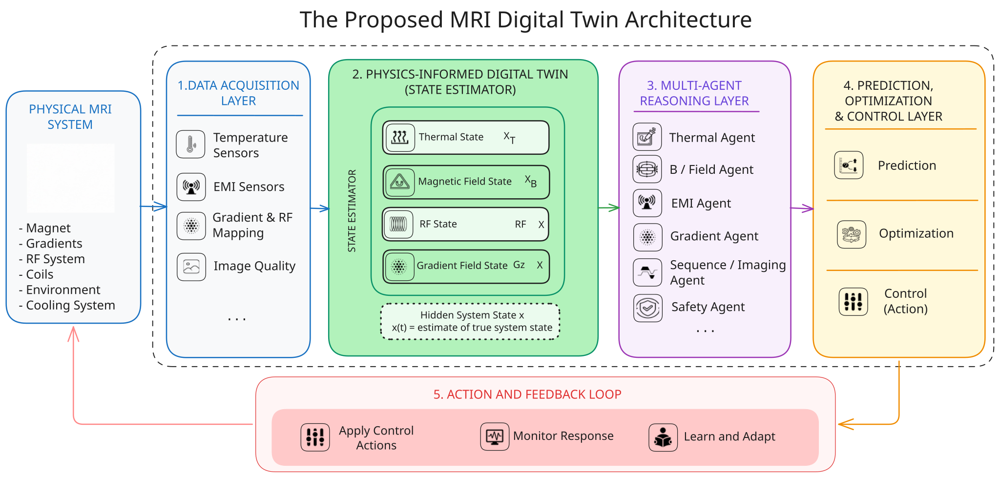
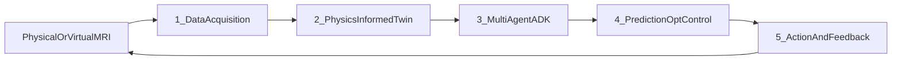

# Architecture

DTAM follows a five-layer closed-loop design around a physical (or simulated) MRI system.



*Proposed MRI digital twin architecture: physical system → data acquisition → physics-informed twin → multi-agent reasoning → prediction / optimization / control → action and feedback.*



## Layers

| # | Layer | Role | Status today |
| --- | --- | --- | --- |
| 0 | Physical / virtual MRI | Magnet, gradients, RF, coils, environment, cooling | Adapter boundary; simulated Halbach profile |
| 1 | Data acquisition | Temperature, EMI, RF noise, … | **Simulated** temp + EMI + RF noise via adapter + thin `acquisition/` facades |
| 2 | Physics-informed twin | Hidden state \(x(t)\): \(x_T\), \(x_B\), \(x_{\mathrm{EMI}}\), \(x_{\mathrm{RF}}\) | Thermal + B₀ + EMI + RF noise estimates; thermal PINN model |
| 3 | Multi-agent reasoning | Google ADK specialists + orchestrator | Thermal, magnet, EMI, RF/B1, gradient; root with `sub_agents` |
| 4 | Prediction / opt / control | Forecast, optimize, command | **Thermal PINN forecast** live; optimization/control deferred |
| 5 | Action and feedback | Apply → monitor → learn | Scaffold only; closed-loop off by default |

See [System map](system-map.md) for package paths, [Why a state system?](why-state-system.md) for the rationale behind \(x(t)\), and [Mathematical models](../digital_twin/mathematical-models.md) for the governing equations.

## Critical rules

1. The **core stays scanner-independent**.
2. Scanner-specific logic lives in **adapters**.
3. Agents must not talk to hardware or define scientific truth — they call tools / twin APIs.
4. Mutating actions require validated command schemas (future control layer).
5. Deterministic safety overrides LLM recommendations (future `safety/` package).
6. Measurements, estimates, and predictions must remain distinguishable (`QuantitySource`).
7. Simulation and physical hardware share the same adapter contract.
8. Autonomous control is disabled by default.

## Modular monolith

DTAM is a modular monolith under `src/dtam/`. Prefer complete vertical slices over empty abstractions that only mirror the ideal directory tree.

## Working vertical slice

```text
Simulated temperatures + EMI + RF noise
  → acquisition facades / adapter batch
  → twin: ThermalState, EmiState, RfState, MagneticState
  → optional thermal PINN prediction
  → ADK orchestrator + specialist agents
```

Control actuators and post-action adaptation remain Phase 5+.
