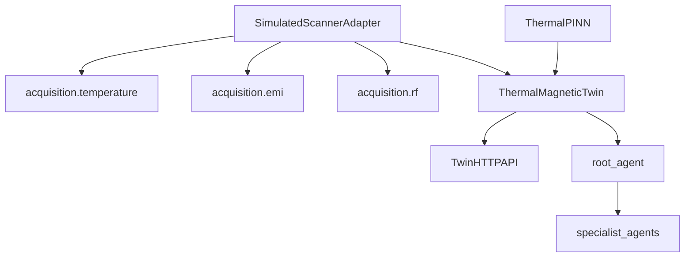

# System map

Maps each box in the [architecture diagram](index.md) to packages and status.

| Diagram box | Package / path | Status |
| --- | --- | --- |
| Physical MRI | `scanner_adapters/` (Halbach profile) | Profile only; no physical I/O |
| Temperature sensors | `acquisition/temperature`, simulated adapter | **Done** (simulation) |
| EMI sensors | `acquisition/emi`, simulated adapter | **Done** (simulation) |
| RF noise | `acquisition/rf`, simulated adapter | **Done** (simulation) |
| Gradient / IQ / mapping | `acquisition/gradients`, `image_quality` | Scaffold |
| Thermal state \(x_T\) | `digital_twin.state.thermal_state` | **Done** |
| Magnetic state \(x_B\) | `digital_twin.state.magnetic_state` | **Done** |
| EMI state \(x_{\mathrm{EMI}}\) | `digital_twin.state.emi_state` | **Done** |
| RF state \(x_{\mathrm{RF}}\) | `digital_twin.state.rf_state` | **Done** (noise floor) |
| Gradient / IQ state | empty state stubs | Scaffold |
| Twin service | `digital_twin.service` | **Done** (thermal/EMI/RF/B₀) |
| Thermal PINN | `digital_twin.models.thermal.pinn` | **Done** (prediction) |
| Thermal / magnet / EMI / RF agents | `agents/{thermal,magnet,emi}_agent`, `rf_agent` | **Done** (ADK + assessment) |
| B1 / gradient agents | `agents/rf_tuning`, `agents/gradient` | **Done** (skills/tools) |
| Motion / safety agents | `agents/motion_tracking`, `agents/safety_agent` | **Done** (assessment) |
| Safety / Sequence / Imaging agents | planned packages | Scaffold / planned |
| Orchestrator | `agents/root` with `sub_agents` | **Done** |
| Prediction (forecast) | thermal PINN + `ThermalForecastService` | **Done** |
| Twin HTTP API | `dtam.api` (`make twin-api`) | **Done** (GUI / Next.js) |
| Optimization / control | `control/`, `workflows/` | Scaffold |
| Action and feedback | `feedback/`, `safety/` | Scaffold |

## Data flow (current slice)

