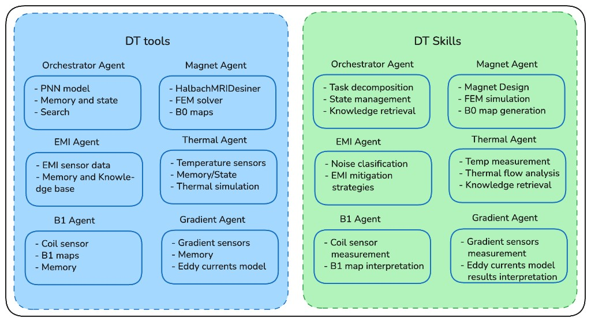

# DT tools and skills

DTAM exposes **tools** (executable functions) and **skills** (ADK `SKILL.md` playbooks) for the specialist team shown below.



## Agent mapping

| Diagram agent | DTAM package / export | Skill group key |
| --- | --- | --- |
| Orchestrator | `root_agent` (with `sub_agents`) | `orchestrator` |
| Magnet | `magnet_agent` (`magnetic_field`) | `magnet` |
| EMI | `emi_agent` | `emi` |
| Thermal | `thermal_agent` | `thermal` |
| B1 / RF | `b1_agent` (`rf_tuning`) | `b1` |
| Gradient | `gradient_agent` | `gradient` |

The root orchestrator is a Google ADK parent agent with specialist `sub_agents`
for thermal, magnet, EMI, B1/RF, and gradient.

## Tools (blue box)

| Agent | Tools |
| --- | --- |
| Orchestrator | PINN status/inference, working-state, knowledge, `estimate_twin_state` |
| Magnet | Halbach designer / FEM / B0 map + twin estimate tools |
| EMI | Adapter EMI summary, classify, knowledge, mitigation + twin estimate |
| Thermal | Temperature channels, thermal flow, gradient analysis + twin estimate |
| B1 / RF | Coil sensor, B1 maps, `read_rf_noise_channels` + twin estimate |
| Gradient | Gradient summary, eddy-current model / interpret |

Tools live under `src/dtam/tools/<domain>/` with **one concern per module**
and a thin `__init__.py` that only re-exports. Example:

```text
tools/magnet/
  __init__.py      # exports MAGNET_TOOLS
  designer.py      # HalbachMRIDesigner wrapper
  fem.py
  b0_maps.py
```

Registration for agents remains in `dtam.tools.registry`.

## Skills (green box)

ADK skill folders under `src/dtam/skills/<skill-name>/SKILL.md`:

- Orchestrator: `task-decomposition`, `state-management`, `knowledge-retrieval`
- Magnet: `magnet-design`, `fem-simulation`, `b0-map-generation`
- EMI: `noise-classification`, `emi-mitigation-strategies`
- Thermal: `temp-measurement`, `thermal-flow-analysis`, `knowledge-retrieval`
- B1: `coil-sensor-measurement`, `b1-map-interpretation`
- Gradient: `gradient-sensors-measurement`, `eddy-currents-interpretation`

Each specialist agent is constructed with `SkillToolset` containing its skills plus matching tools (`dtam.skills.skill_toolset_for_agent`).

## PINN model upload

Place trained weights in:

```text
data/models/pinn/
```

Prefer `model.onnx` + `manifest.json` (see `data/models/pinn/README.md`). Override with `DTAM_PINN_MODEL_DIR`.

## HalbachMRIDesigner

See [Third-party](../project/third-party.md) and Magnet tools. Clone into `third_party/HalbachMRIDesigner` or set `DTAM_HALBACH_DESIGNER_PATH`.
