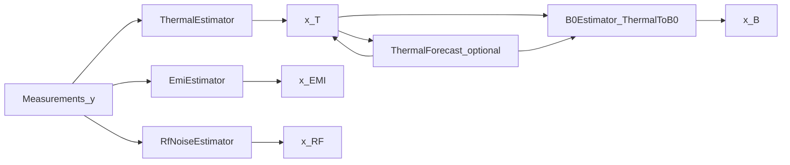

# Mathematical models

This page documents the **physics and estimation models** used by DTAM’s MRI
scanner digital twin today. They are intentionally **lumped, simulation-first,
and configurable** — not a full scanner FEM or Bloch simulator.

For *why* these quantities live in a state system, see
[Why a state system?](../architecture/why-state-system.md).
For PINN training and artifacts, see [Thermal PINN](thermal-pinn.md).

## Scanner profile

Default virtual / Halbach-oriented profile:

| Quantity | Symbol | Default | Config |
| --- | --- | --- | --- |
| Nominal static field | \(B_{0,\mathrm{nom}}\) | \(0.048\,\mathrm{T}\) | scanner profile `field_strength_t` |
| Reference magnet temperature | \(T_{\mathrm{ref}}\) | \(23\,^\circ\mathrm{C}\) | `configs/models.yaml` |
| Thermal→field coefficient | \(\alpha_T\) | \(-5\times 10^{-5}\,\mathrm{T}/^\circ\mathrm{C}\) | `alpha_t_tesla_per_c` |
| Proton \(\gamma/2\pi\) | \(\gamma/(2\pi)\) | \(42\,577\,478.92\,\mathrm{Hz}/\mathrm{T}\) | `PROTON_GAMMA_OVER_TWO_PI_HZ_PER_T` |
| Thermal time constant | \(\tau\) | \(60\,\mathrm{s}\) (sim / PINN default) | plant / twin config |

At \(B_{0,\mathrm{nom}}=0.048\,\mathrm{T}\),

\[
f_{0,\mathrm{nom}} = \frac{\gamma}{2\pi}\,B_{0,\mathrm{nom}}
\approx 2.044\,\mathrm{MHz}.
\]

## Twin state as \(x(t)\)

The composite twin snapshot is

\[
x(t) =
\bigl(
x_T(t),\;
x_B(t),\;
x_{\mathrm{EMI}}(t),\;
x_{\mathrm{RF}}(t)
\bigr),
\]

serialized as `SystemState`. Each scalar field carries a
`TimestampedQuantity` with provenance
\(\mathrm{source}\in\{\mathrm{measured},\mathrm{estimated},\mathrm{predicted},\mathrm{nominal}\}\).

## Thermal plant (simulation)

Virtual plant: `dtam.simulation.thermal.model.ThermalPlantModel`.

Continuous idealization for a magnet channel:

\[
\frac{dT}{dt} = \frac{T^* - T}{\tau}
\]

with closed form

\[
T(t) = T^* + (T_0 - T^*)\,e^{-t/\tau}.
\]

Discrete update used in the plant (`α = clamp(dt/τ, 0, 1)`):

\[
T_{k+1} = T_k + \alpha\,(T^*_k - T_k).
\]

Room channel mixes toward ambient \(T_{\mathrm{amb}}\) (default \(22\,^\circ\mathrm{C}\)):

\[
T^*_{\mathrm{room}} \leftarrow 0.8\,T^*_{\mathrm{room}} + 0.2\,T_{\mathrm{amb}}.
\]

## Thermal estimation

From usable temperature measurements, magnet channels
\(\{T_i\}\) (ids with prefix `temp_magnet`) and room \(T_{\mathrm{room}}\):

\[
\begin{aligned}
\bar T &= \frac{1}{N}\sum_{i=1}^{N} T_i, \\
\Delta T &= \bar T - T_{\mathrm{ref}}, \\
\nabla_{\mathrm{th}} &= \max_i T_i - \min_i T_i, \\
\sigma_{\bar T} &= \sqrt{\frac{1}{N^2}\sum_{i=1}^{N}\sigma_i^2}.
\end{aligned}
\]

These populate \(x_T\) (`ThermalState`): measured channels vs estimated
aggregates.

## Thermal → \(B_0\) coupling

Model: `ThermalToB0Model` (`configs/models.yaml`).

\[
\Delta B_0(t) = \alpha_T\,\Delta T(t) + \varepsilon,
\qquad
B_0(t) = B_{0,\mathrm{nom}} + \Delta B_0(t).
\]

Default \(\alpha_T < 0\) (NdFeB-like remanence temperature coefficient).
Validity window for temperatures: roughly \(5\)–\(40\,^\circ\mathrm{C}\).
Process noise std on field: \(\sigma_\varepsilon \approx 10^{-6}\,\mathrm{T}\).

Uncertainty propagation (estimator):

\[
\sigma_{B_0}
=
\sqrt{
\bigl(|\alpha_T|\,\sigma_{\Delta T}\bigr)^2
+ \sigma_\varepsilon^2
}.
\]

## Resonant frequency

Model: `ResonantFrequencyModel`.

\[
f_0 = \frac{\gamma}{2\pi}\,B_0
\qquad\text{(Hz)},
\qquad
f_0^{\mathrm{(MHz)}} = f_0 / 10^6.
\]

Twin magnetic state exposes **`resonant_frequency_mhz`** (and predicted
analogues after a forecast).

## Thermal forecast

### Physics-informed network (preferred)

Same ODE as the plant. Network \(\hat T(t;\,T_0,T^*,\tau)\) trained with data,
physics residual, and IC losses. Residual:

\[
R = \partial_t\hat T - \frac{T^* - \hat T}{\tau}.
\]

Full design: [Thermal PINN](thermal-pinn.md).

If setpoint \(T^*\) is unknown at inference, an implied setpoint from heating
rate \(r\) (°C/s) is

\[
T^* = T_0 + r\,\tau.
\]

### Linear-rate fallback

If no PINN artifact is loaded:

\[
\hat T(t+h) = \bar T(t) + r\,h.
\]

Predicted \(\hat T\) maps through \(\alpha_T\) to predicted \(B_0\) / \(f_0\).

## EMI model (heuristic)

Not a full EM solver. From EMI RMS channels \(V_{\mathrm{rms}}\) and optional
metadata peak frequency \(f_{\mathrm{peak}}\):

\[
\overline{V}_{\mathrm{rms}} = \frac{1}{M}\sum_{j=1}^{M} V_{\mathrm{rms},j}.
\]

Classification label (simulation heuristic):

| Condition | Label |
| --- | --- |
| \(f_{\mathrm{peak}} > 1\,\mathrm{kHz}\) and \(\overline{V}_{\mathrm{rms}} > 5\,\mathrm{mV}\) | `narrowband` |
| \(\overline{V}_{\mathrm{rms}} < 2\,\mathrm{mV}\) | `nominal` |
| otherwise | `broadband` |

## RF noise model (heuristic)

From noise-floor channels \(N\) in \(\mathrm{dBm}/\mathrm{Hz}\):

\[
\bar N = \frac{1}{K}\sum_{k=1}^{K} N_k,
\qquad
\mathrm{SNR}_{\mathrm{proxy}} = \bar N - (-145)\;\mathrm{dB}
\]

(relative to a quiet-floor heuristic of \(-145\,\mathrm{dBm}/\mathrm{Hz}\)).
Optional `bandwidth_hz` comes from measurement metadata.

## State update (operational)

One twin update (`ThermalMagneticTwin.update`):

1. Synchronize temperature window → \(x_T\) (estimate).
2. Optionally forecast \(x_T\) over horizon \(h\).
3. Map \(x_T \rightarrow x_B\) (estimate or predict).
4. Estimate \(x_{\mathrm{EMI}}\), \(x_{\mathrm{RF}}\) from the same batch.
5. Emit `SystemState` with notes and `twin_version`.

HTTP / GUI consumers see this snapshot via the
[Twin HTTP API](../platform/twin-api.md).

## Explicit non-models (today)

These are **out of scope** for the current math layer:

- Spatial magnet FEM / Halbach geometry solvers inside the twin loop
- Bloch equations / image formation / k-space
- Full EMI Maxwell solvers or SDR spectral estimators
- Gradient eddy-current PDE models
- Closed-loop control laws (actuators disabled by default)

Upstream Halbach design tooling may be invoked separately as a subprocess; it
is not the runtime twin state model.

## Code map

| Model | Path |
| --- | --- |
| Thermal plant | `dtam.simulation.thermal.model` |
| Thermal estimator | `dtam.digital_twin.estimators.thermal_estimator` |
| Thermal→\(B_0\) | `dtam.digital_twin.models.thermal.thermal_to_b0` |
| Resonant frequency | `dtam.digital_twin.models.magnetic_field.resonant_frequency` |
| \(B_0\) estimator | `dtam.digital_twin.estimators.b0_estimator` |
| Thermal forecast / PINN | `dtam.digital_twin.estimators.thermal_forecast`, `...models.thermal.pinn` |
| EMI / RF estimators | `dtam.digital_twin.estimators.emi_estimator`, `rf_estimator` |
| Twin orchestration | `dtam.digital_twin.service` |
| Coefficients | `configs/models.yaml` |
