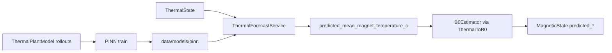

# Thermal PINN — design and usage

This page documents the **physics-informed neural network** used for magnet
temperature forecasting in DTAM. The model predicts future mean magnet
temperature; \(B_0\) / \(f_0\) still come from the analytic
[`ThermalToB0`](index.md) coupling (\(\Delta B_0 = \alpha_T \Delta T\)).

## Role in the twin



When `ThermalMagneticTwin.update(..., predict_horizon_s=h)` runs:

1. `ThermalEstimator` builds the current thermal state from measurements.
2. `ThermalForecastService` loads a PINN from `data/models/pinn/` if present;
   otherwise it falls back to a constant heating-rate extrapolation
   \(T(t+h)=T(t)+r\cdot h\).
3. Forecasted \(\bar T\) is stored as
   `predicted_mean_magnet_temperature_c` (`QuantitySource.PREDICTED`).
4. `B0Estimator.predict` maps that temperature through \(\alpha_T\) to
   predicted \(B_0\) / \(f_0\) (MHz).

## Governing physics

The PINN targets the same **lumped first-order ODE** as the simulated thermal
plant (`dtam.simulation.thermal.model.ThermalPlantModel`):

\[
\frac{dT}{dt} = \frac{T^* - T}{\tau}
\]

| Symbol | Meaning | Unit |
| --- | --- | --- |
| \(T(t)\) | Magnet mean temperature | °C |
| \(T_0\) | Temperature at forecast origin | °C |
| \(T^*\) | Effective setpoint | °C |
| \(\tau\) | Thermal time constant | s |
| \(t\) | Forecast horizon from origin | s |

Closed-form reference (for evaluation, not used as the learned model):

\[
T(t) = T^* + (T_0 - T^*)\,e^{-t/\tau}
\]

At inference, if \(T^*\) is unknown, the twin derives an implied setpoint from
the heating-rate knob:

\[
T^* = T_0 + r\,\tau
\]

where \(r\) is `magnet_heating_rate_c_per_s`.

## Network design

**Package:** `dtam.digital_twin.models.thermal.pinn`

| Module | Responsibility |
| --- | --- |
| `network.py` | MLP + IC-satisfying ansatz |
| `physics.py` | Autograd residual and PINN loss |
| `dataset.py` | Rollouts from `ThermalPlantModel` |
| `train.py` | Training loop + CLI |
| `export.py` | `model.pt` / optional ONNX + `manifest.json` |
| `predictor.py` | Load artifacts and run inference |

### Inputs and output

Feature vector (batch of shape `(N, 4)`):

\[
\mathbf{x} = [\,t,\; T_0,\; T^*,\; \tau\,]
\]

Output: \(\hat T(\mathbf{x})\) in °C.

### Architecture

Default: depth-3 MLP, width 64, GELU activations.

**Initial-condition ansatz** (hard constraint \(\hat T(0)=T_0\)):

\[
\hat T(t, T_0, T^*, \tau)
  = T_0 + t \cdot N_\theta(t, T_0, T^*, \tau)
\]

where \(N_\theta\) is the raw network. This makes the IC loss identically zero
and stabilizes short training runs.

## Training objective

Composite loss on plant rollouts and collocation points:

\[
\mathcal{L}
  = \lambda_{\mathrm{data}}\|\hat T - T_{\mathrm{data}}\|^2
  + \lambda_{\mathrm{phys}}\Big\|
      \partial_t\hat T - \frac{T^*-\hat T}{\tau}
    \Big\|^2
  + \lambda_{\mathrm{ic}}\|\hat T(0)-T_0\|^2
\]

| Term | Role |
| --- | --- |
| Data | Fit simulated plant trajectories |
| Physics | Soft ODE residual via autograd \(\partial_t\hat T\) |
| IC | Soft IC (redundant with the ansatz; kept for clarity / future nets) |

Defaults: \(\lambda_{\mathrm{data}}=\lambda_{\mathrm{phys}}=\lambda_{\mathrm{ic}}=1\).

### Training data

`generate_plant_rollouts` rolls a magnet-only `ThermalPlantModel` over randomized
\((T_0, T^*, \tau)\) and flattens \((t, T_{\mathrm{obs}})\) rows. Collocation
samples reuse those parameter ranges with random times for the physics residual.

### Dependencies

Optional extra (core install stays light):

```bash
uv sync --extra pinn
```

Provides `torch`, `onnx`, and `onnxruntime` (pinned for Python 3.10 wheels).

## Artifacts and manifest

Train CLI writes into `data/models/pinn/` (weights are gitignored):

```bash
uv run --extra pinn python -m dtam.digital_twin.models.thermal.pinn.train \
  --epochs 1000 --out data/models/pinn
```

| File | Role |
| --- | --- |
| `model.pt` | Primary PyTorch checkpoint |
| `model.onnx` | Optional portable export |
| `manifest.json` | I/O schema, physics note, training metadata |

Override directory with `DTAM_PINN_MODEL_DIR`.

Example feature packing for agents / tools:

```json
{"horizon_s": 60, "T0_c": 23.0, "T_star_c": 26.0, "tau_s": 60.0}
```

or

```json
{"features": [[60.0, 23.0, 26.0, 60.0]]}
```

## Runtime API

| Surface | Notes |
| --- | --- |
| `ThermalPinnPredictor` | Load `.pt` (preferred) or `.onnx` |
| `ThermalForecastService` | Twin-facing forecast + linear fallback |
| `ThermalMagneticTwin` | `use_thermal_pinn`, `pinn_model_dir`, `default_tau_s` |
| `pinn_model_status` | Artifact presence / backend |
| `run_pinn_inference` | Direct feature → `T_hat_c` |
| `estimate_thermal_b0_state` | Twin update + optional horizon / setpoint |

### Sanity check after training

```bash
uv run python -c "from dtam.tools.orchestrator import pinn_model_status; print(pinn_model_status())"
```

Expect `present=True`, `inference_ready=True`, `inference_backend='torch'`.

Reference point \(T_0=23\), \(T^*=26\), \(\tau=60\), \(t=60\):

- Analytic: \(\approx 24.90\,^\circ\mathrm{C}\)
- Well-trained PINN (≈1000 epochs): typically within ~0.5 °C of analytic

## Explicit non-goals (this model)

- Spatial / FEM thermal fields
- Learning \(\alpha_T\) or \(B_0\) inside the PINN
- Physical scanner datasets (simulation-first only for now)
- Replacing measured/estimated thermal state — PINN fills **predicted** quantities only

## Related

- Twin overview: [Phase 2 — Thermal and B₀](index.md)
- Upload / path notes: repository `data/models/pinn/README.md`
- Status: [Getting started → Status](../start/status.md)
